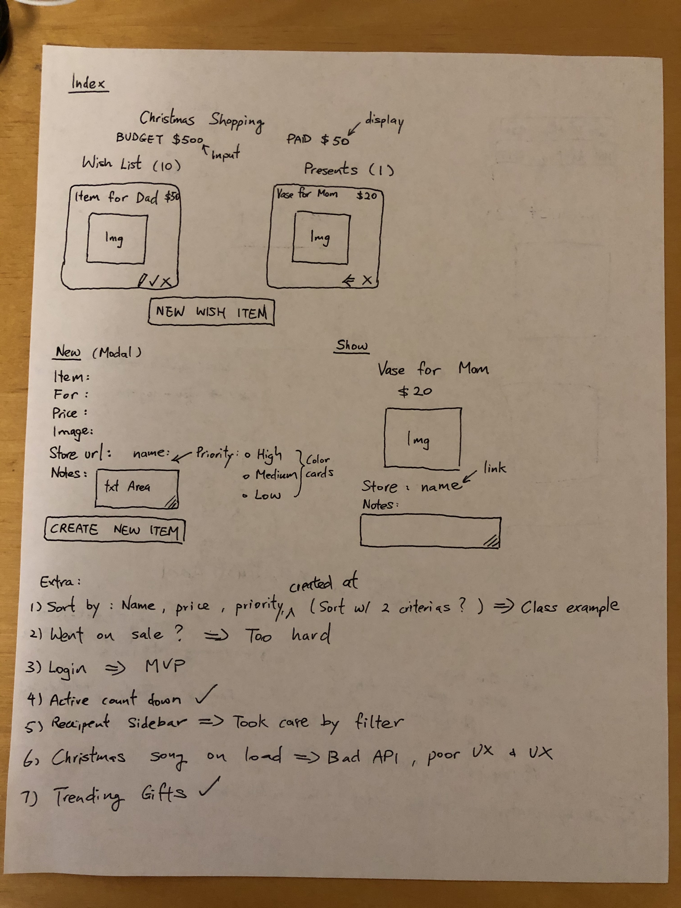

# christmas-shopping

## Collaborators

- Adam Hwung
- Tori-Ann Watkis
- Wincy Law

## Link to Live Website

https://holishopper.herokuapp.com/

## Overview

Created shopping application in order to allow users to create a shopping list for Christmas and keep track of all the presents for their loved ones

## Features

- User can create an account and see their own personal shopping list (Wishlist, Purchased)
- New items can be created with all the pertinent information about the item, like website, price, etc.
- Shopping list can be organized by price, to whom the present is for, and other categories
- Toggle item between Wishlist and Purchased
- Able to update, delete and return the items
- Budget table that shows how much money is being spent on each recipient category
- Filter the Wishlist and Purchased items based on recipient category
- Total budget shown on left sidebar to show how much money is being spent
- Countdown to Christmas
- Carousel of trending holiday gifts (with links to store website) based on all items in database contributed from all users

## Resources Used

- MongoDB Atlas
- Heroku

## Wire Framing


## Technologies Used

- HTML
- CSS
- JavaScript
- Google fonts
- Materialize
- AngularJS with $http and $timeout

## Dependencies

- Bcrypt
- Dotenv
- Express
- Express-session
- Mongoose

## Work Flow

## Approach Taken
Here are the steps taken to populate the index Page

### Wishlist/Purchased: Find wishlist based on username and complete.  User can enforce additional sort and filter
- Pulls in entire wishlist from the database and display the appropriate ones on index
```html
<div class="card sticky-action" ng-repeat="item in ctrl.wishlist
| filter:{'complete':false}:true | filter:{'recipientCategory':ctrl.searchBox}:true | filter:{'username':ctrl.loggedInUser.username}:true
| orderBy: order" ng-class="(item.priority === 'high') ? 'high' : ''">
```

### Budget table
- Filter out the wishlist into a userWishlist for calculations
```js
if (this.loggedInUser) {
  this.userWishlist = this.wishlist.filter((item) => {
    return item.username == this.loggedInUser.username;
  })
```

- Populate table with ng-repeat
```html
<tr>
  <td>Budget</td>
  <td ng-repeat="category in ctrl.uniqueRecipientCategory">{{ctrl.sumMoney(category, false)}} ({{ctrl.sumMoney(category, false)/ctrl.budget*100|number: 0}}%)</td>
  <td>{{ctrl.budget|currency}}</td>
</tr>
```

- this.budgetTable() to calculate uniqueRecipientCategory and the total amount
```js
this.paid = this.paidArray.reduce((a, b) => a + b);
this.budget = this.budgetArray.reduce((a, b) => a + b);

// Create unique recipient category for table
this.uniqueRecipientCategory = [...new Set(this.recipientCategoryArray)].sort();
```

- this.sumMoney(category, complete) to calculate the total for each unique category
```js
this.filteredWishlist = this.userWishlist.filter((item) => {
return item.recipientCategory.toLowerCase()===category;
})

for (var i = 0; i < this.filteredWishlist.length; i++) {
if (this.filteredWishlist[i].complete === complete) {
this.total += this.filteredWishlist[i].price}
}
```

### Slideshow
- Recursion because setTimeout was non-blocking
- Use Angular $timeout in order to initiate Angular digest cycle
- Use this.isRunning = false is ensure slideShow() is only called on load since it's part of the getWishlist()
```js
slideShow = () => {

  if (k >= this.wishlist.length-3) {
    k= -1;
  }
  k++;

$timeout(() => {

  this.slideImage = this.wishlist[k].image;
  this.slideLink = this.wishlist[k].storeUrl;
  this.slideImage1 = this.wishlist[k+1].image;
  this.slideLink1 = this.wishlist[k+1].storeUrl;
  this.slideImage2 = this.wishlist[k+2].image;
  this.slideLink2 = this.wishlist[k+2].storeUrl;

  slideShow();

}, 3000)

}
```
